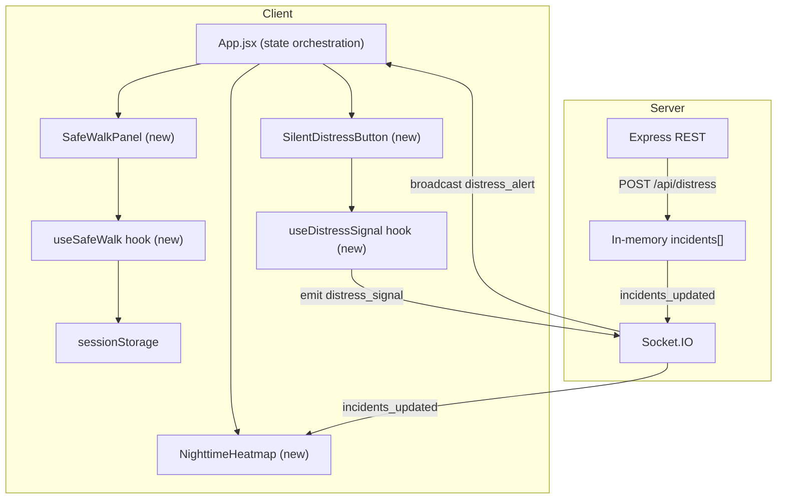

# Design Document — UW Student Safety Enhancements

## Overview

This document describes the technical design for three nighttime safety features added to the UW Safety Map:

1. **Safe Walk Mode** — a timed check-in session persisted to `sessionStorage` that alerts an emergency contact if the student does not check in before the timer expires.
2. **Silent Distress Signal** — a one-tap Socket.IO broadcast with a 3-second cancellable countdown that shares the student's location with all connected clients and stores a distress incident on the server.
3. **Nighttime Heatmap** — a grid-based density overlay filtered to the 8 PM–4 AM window, rendered on top of the existing Leaflet map with live updates and a legend.

All three features are additive — they extend the existing React + Socket.IO + Express architecture without replacing any current functionality.

---

## Architecture

The existing architecture is a single-page React app (Vite) communicating with a Node.js/Express/Socket.IO server over both REST and WebSocket. The three new features fit into this model as follows:



### Key Architectural Decisions

- **Safe Walk is client-only** — the timer runs in the browser. The server only receives a log entry when the session expires without check-in (POST to a new `/api/safe-walk/expired` endpoint). No polling; the client owns the countdown via `useRef` + `setInterval`.
- **Distress Signal uses Socket.IO emit** — the client emits `distress_signal` directly over the existing socket. The server handles it in the `io.on('connection')` block, stores a distress incident, and broadcasts `distress_alert` + `incidents_updated`.
- **Heatmap is a pure client computation** — the grid is computed from the `incidents` array already in client state. No new server endpoint is needed. The heatmap re-renders whenever `incidents` changes.
- **sessionStorage for Safe Walk** — `sessionStorage` survives page refreshes within the same tab but is cleared when the tab closes, which is the correct behavior for a walk session.

---

## Components and Interfaces

### New Client Components

#### `SafeWalkPanel.jsx` + `SafeWalkPanel.css`
Renders the Safe Walk UI: the activation button, the setup form (duration + emergency contact), the active session countdown, and the expiry alert overlay.

Props: none (reads/writes via `useSafeWalk` hook)

Internal states managed by hook: `idle | setup | active | expired`

#### `SilentDistressButton.jsx` + `SilentDistressButton.css`
A persistent button on the map view. On tap, shows a 3-second countdown overlay with a Cancel option. On confirmation (or countdown completion), emits the distress signal.

Props:
```js
{
  socket: Socket,           // from useSocket
  userLocation: {lat, lng} | null,  // from browser geolocation
  mapCenter: [lat, lng],    // fallback from SafetyMap
}
```

#### `NighttimeHeatmap.jsx` + `NighttimeHeatmap.css`
A Leaflet layer component rendered inside `<MapContainer>`. Draws colored `<Rectangle>` cells over the UW bounding box grid. Also renders the legend and incident count.

Props:
```js
{
  incidents: Incident[],
  active: boolean,
}
```

### New Hooks

#### `useSafeWalk.js`
Manages the full Safe Walk session lifecycle.

```js
// Returns:
{
  phase,           // 'idle' | 'setup' | 'active' | 'expired'
  remaining,       // seconds remaining
  contact,         // emergency contact string
  duration,        // original duration in seconds
  startSession,    // (durationMinutes, contact) => void
  checkIn,         // () => void
  endSession,      // () => void
}
```

Internally uses `setInterval` (stored in `useRef`) for the countdown. Reads/writes `sessionStorage` under the key `uw_safe_walk_session`.

#### `useDistressSignal.js`
Handles the distress signal flow: countdown, cancellation, emit, and server logging.

```js
// Returns:
{
  phase,           // 'idle' | 'countdown' | 'sent'
  countdown,       // 3..0
  initiate,        // () => void
  cancel,          // () => void
}
```

### Modified Components

| Component | Change |
|---|---|
| `App.jsx` | Mount `SafeWalkPanel`, `SilentDistressButton`; add heatmap toggle state; pass `socket` and `mapCenter` to new components; listen for `distress_alert` socket event |
| `SafetyMap.jsx` | Accept `heatmapActive` and `incidents` props; render `<NighttimeHeatmap>` inside `<MapContainer>` when active |
| `Header.jsx` | Add Heatmap toggle button |
| `server/index.js` | Add `distress_signal` socket listener; add `POST /api/safe-walk/expired` endpoint; add `'Distress Signal'` to incident handling |
| `constants.js` | Add `HEATMAP_CELL_SIZE`, `NIGHTTIME_START_HOUR`, `NIGHTTIME_END_HOUR`, `DISTRESS_SIGNAL_TYPE` |

---

## Data Models

### sessionStorage — Safe Walk Session

Key: `uw_safe_walk_session`

```json
{
  "durationSeconds": 1800,
  "startedAt": 1720000000000,
  "contact": "206-555-0100",
  "originalDuration": 1800
}
```

`remaining = durationSeconds - Math.floor((Date.now() - startedAt) / 1000)`

On resume: if `remaining > 0`, restore session; otherwise treat as expired.

### Socket Events (new)

| Event | Direction | Payload |
|---|---|---|
| `distress_signal` | client → server | `{ lat, lng, timestamp }` |
| `distress_alert` | server → all clients | `{ id, lat, lng, timestamp, type: 'Distress Signal' }` |

### REST Endpoints (new)

| Method | Path | Body | Description |
|---|---|---|---|
| POST | `/api/safe-walk/expired` | `{ contact, lat, lng, expiredAt }` | Server logs expired session |
| POST | `/api/distress` | (internal, called by socket handler) | Stores distress incident |

The distress incident stored in `incidents[]` follows the existing incident shape:

```js
{
  id: uuidv4(),
  lat, lng,
  type: 'Distress Signal',
  description: 'Silent distress signal from student',
  source: 'distress',
  timestamp: Date.now(),
  expiresAt: Date.now() + EXPIRY_MS,
  confirmations: 0,
  active: true,
}
```

### Heatmap Grid

The UW bounding box is divided into cells of `HEATMAP_CELL_SIZE = 0.002` degrees (≈ 150 m × 175 m at this latitude). The grid is computed client-side:

```
cols = Math.ceil((east - west) / HEATMAP_CELL_SIZE)   // ≈ 17
rows = Math.ceil((north - south) / HEATMAP_CELL_SIZE)  // ≈ 11
```

Each cell stores an incident count. Density thresholds:
- Low (green `#4caf50`): 1–2 incidents
- Medium (amber `#ff9800`): 3–5 incidents
- High (red `#e53935`): 6+ incidents
- Empty: transparent (not rendered)

---

## Correctness Properties

*A property is a characteristic or behavior that should hold true across all valid executions of a system — essentially, a formal statement about what the system should do. Properties serve as the bridge between human-readable specifications and machine-verifiable correctness guarantees.*

### Property 1: Safe Walk timer is bounded by duration

*For any* valid Safe Walk session with a given duration D and any elapsed time T, the `remaining` value returned by `useSafeWalk` must always satisfy `0 ≤ remaining ≤ D`.

**Validates: Requirements 1.4, 1.5**

---

### Property 2: Check-in resets timer to full duration

*For any* active Safe Walk session with original duration D and any remaining time R (where 0 < R ≤ D), calling `checkIn()` must result in `remaining` being reset to D (within one tick tolerance).

**Validates: Requirements 2.4**

---

### Property 3: sessionStorage round-trip preserves session state

*For any* Safe Walk session object (durationSeconds, startedAt, contact), serializing it to `sessionStorage` and then deserializing it must produce an equivalent session where the computed `remaining` matches `durationSeconds - elapsed` within one second tolerance.

**Validates: Requirements 3.1, 3.2**

---

### Property 4: Ended session is cleared from sessionStorage

*For any* Safe Walk session that ends — whether via `endSession()` or timer expiry — `sessionStorage` must contain no entry under the key `uw_safe_walk_session` after the session ends.

**Validates: Requirements 3.3**

---

### Property 5: Cancelling distress countdown prevents socket emit

*For any* distress signal initiation that receives a `cancel()` call before the 3-second countdown reaches zero, no `distress_signal` socket event must be emitted and the phase must return to `'idle'`.

**Validates: Requirements 4.7**

---

### Property 6: Distress signal is broadcast and stored

*For any* `distress_signal` socket event received by the server with valid coordinates, the server must (a) emit a `distress_alert` event to all connected clients, (b) emit `incidents_updated` with the updated array, and (c) have a new entry in the incidents array with `type === 'Distress Signal'` and matching coordinates.

**Validates: Requirements 4.4, 4.8**

---

### Property 7: Heatmap filters to nighttime incidents only

*For any* set of incidents with arbitrary timestamps, the sum of all heatmap cell counts must equal exactly the number of incidents whose local-time hour falls within [20, 23] ∪ [0, 3] (8 PM–4 AM). Incidents outside this window must not contribute to any cell count.

**Validates: Requirements 5.4, 6.2**

---

### Property 8: Each nighttime incident is counted in exactly one cell

*For any* set of nighttime incidents, the sum of all heatmap cell counts must equal the total number of nighttime incidents — no incident is double-counted and no incident is omitted.

**Validates: Requirements 5.2, 6.3**

---

### Property 9: New nighttime incident increments the correct cell

*For any* active heatmap state, adding a single new incident whose timestamp falls within the Nighttime_Window must cause the cell that contains that incident's coordinates to increase its count by exactly 1, with all other cells unchanged.

**Validates: Requirements 5.5**

---

### Property 10: Duration validation rejects out-of-range values

*For any* duration value less than 1 or greater than 60 (minutes), calling `startSession` must return a validation error and the session phase must remain `'idle'`.

**Validates: Requirements 1.7**

---

### Property 11: Contact validation rejects empty or whitespace-only strings

*For any* contact string composed entirely of whitespace characters (including the empty string), calling `startSession` must return a validation error and the session phase must remain `'idle'`.

**Validates: Requirements 1.8**

---

### Property 12: Heatmap cell color matches density bucket

*For any* heatmap cell with incident count C, the rendered color must be: transparent if C = 0, green (`#4caf50`) if 1 ≤ C ≤ 2, amber (`#ff9800`) if 3 ≤ C ≤ 5, and red (`#e53935`) if C ≥ 6.

**Validates: Requirements 5.3**

---

### Property 13: Heatmap cell dimensions do not exceed 0.002 degrees

*For any* cell in the heatmap grid, its latitude span and longitude span must each be ≤ 0.002 degrees.

**Validates: Requirements 6.3**

---

### Property 14: Timer urgency state activates below 60 seconds

*For any* active Safe Walk session where `remaining` drops below 60 seconds, the urgency CSS class (red + pulsing) must be applied to the timer display element.

**Validates: Requirements 2.6**

---

### Property 15: Incident pins remain visible while heatmap is active

*For any* set of incidents and an active heatmap, the incident marker elements must still be present in the rendered map alongside the heatmap cell rectangles.

**Validates: Requirements 5.8**

---

## Error Handling

### Safe Walk Mode

| Scenario | Handling |
|---|---|
| Duration out of range (< 1 or > 60 min) | Inline validation error in setup form; session not started |
| No emergency contact provided | Inline validation error; session not started |
| `sessionStorage` unavailable (private browsing restriction) | Catch `SecurityError`; session runs in-memory only, warn user that refresh will end session |
| Page closed mid-session | Session data remains in `sessionStorage` but is tab-scoped; on next open of same tab, resume logic fires |

### Silent Distress Signal

| Scenario | Handling |
|---|---|
| Geolocation denied or unavailable | Fall back to current map center (`UW_CENTER`) |
| Socket disconnected at time of send | Show error toast; do not silently fail |
| Server unreachable | Socket emit fails silently; client shows "Could not send alert — call 206-685-1800" |

### Nighttime Heatmap

| Scenario | Handling |
|---|---|
| Fewer than 3 nighttime incidents | Display informational message instead of heatmap cells (Requirement 5.7) |
| All incidents are daytime | Same as above — 0 nighttime incidents triggers the message |
| Incidents array is empty | Same path as < 3 |

---

## Testing Strategy

### Dual Testing Approach

Both unit tests and property-based tests are required. They are complementary:
- **Unit tests** cover specific examples, integration points, and error conditions.
- **Property-based tests** verify universal invariants across randomly generated inputs.

### Property-Based Testing Library

Use **[fast-check](https://github.com/dubzzz/fast-check)** (TypeScript/JavaScript PBT library). Install in the client test environment:

```bash
npm install --save-dev fast-check vitest
```

Each property test must run a minimum of **100 iterations** (fast-check default is 100; do not lower it).

Each property test must be tagged with a comment in this format:
```
// Feature: uw-student-safety-enhancements, Property N: <property text>
```

### Property Tests (one test per property)

| Property | Test Description |
|---|---|
| P1: Timer bounded | Generate random durations (1–3600 s) and elapsed times; assert `0 ≤ remaining ≤ duration` |
| P2: Check-in resets | Generate random sessions with arbitrary remaining time; call `checkIn()`; assert `remaining === originalDuration` |
| P3: sessionStorage round-trip | Generate random session objects; serialize → deserialize; assert computed remaining matches expected |
| P4: Session cleared on end | Generate sessions; call `endSession()` or simulate expiry; assert `sessionStorage` key absent |
| P5: Cancel prevents emit | Generate cancel calls at random times (0–2999 ms into countdown); assert no socket emit occurred |
| P6: Distress broadcast + stored | Generate random coordinates; assert server emits `distress_alert`, `incidents_updated`, and incident stored with correct type |
| P7: Nighttime filter | Generate incidents with random timestamps; assert only 8 PM–4 AM incidents appear in cell counts |
| P8: Cell count sum | Generate random nighttime incident sets; assert `sum(cellCounts) === nighttimeIncidents.length` |
| P9: Heatmap live update | Generate heatmap state + new nighttime incident; assert target cell count increments by exactly 1 |
| P10: Duration validation | Generate out-of-range durations (< 1 or > 60); assert validation error, phase stays `'idle'` |
| P11: Contact validation | Generate empty/whitespace strings; assert validation error, phase stays `'idle'` |
| P12: Cell color matches density | Generate cells with random counts; assert color matches the correct density bucket |
| P13: Cell size invariant | Assert every cell in the computed grid has lat span ≤ 0.002 and lng span ≤ 0.002 |
| P14: Urgency state below 60 s | Generate sessions with remaining < 60; assert urgency CSS class is applied |
| P15: Pins visible with heatmap | Generate incident sets with heatmap active; assert incident marker elements are present in render output |

### Unit Tests

- Safe Walk setup form renders validation errors for bad inputs (examples: `0`, `61`, `""`)
- `useSafeWalk` resumes correctly from a pre-populated `sessionStorage` entry
- `SilentDistressButton` countdown renders 3 → 2 → 1 → sends
- Heatmap shows informational message when nighttime incident count < 3
- Heatmap legend renders all three color bands
- Cell tooltip shows correct count on hover
- `distress_alert` socket event triggers a high-priority notification toast in `App.jsx`
- Server `POST /api/safe-walk/expired` returns 200 and logs the contact

### Integration Points to Test

- `useSafeWalk` + `sessionStorage` (resume on reload)
- `useDistressSignal` + `useSocket` (emit path)
- `NighttimeHeatmap` + `incidents` prop reactivity (re-render on new incident)
